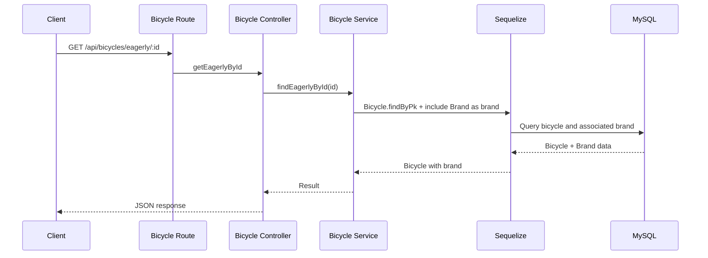
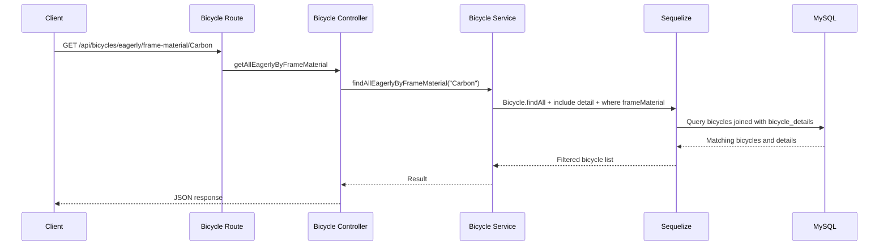

# Bicycle Shop

A full-stack learning project for managing a bicycle shop through a REST API and a React user interface.

The project uses a backend built with TypeScript, Node.js, Express, Sequelize, and MySQL, together with a frontend built with TypeScript, React, Vite, and Tailwind CSS. It provides CRUD operations for bicycles, brands, and bicycle technical details, as well as eager-loading queries using Sequelize associations.

## Getting Started

These instructions will help you set up and run the project locally for development and testing.

### Prerequisites

Make sure the following software is installed:

- Git
- Node.js with npm
- MySQL
- Postman (recommended for testing the API)

A Node.js version compatible with the installed Vite version is required.

### Installing

Clone the repository and enter the project directory:

```bash
git clone <REPOSITORY_URL>
cd bicycle-shop-dsw-entrega-3
```

The project contains two applications:

```text
bicycle-shop-dsw-entrega-3/
├── backend/
├── frontend/
└── README.md
```

### Database setup

Start MySQL and create the database:

```sql
CREATE DATABASE IF NOT EXISTS db_bicycle_shop
CHARACTER SET utf8mb4;
```

The configured MySQL user must have permission to access the database and create its tables.

### Backend configuration

Create a `.env` file inside `backend/`. Use `backend/.env.example` as a reference:

```dotenv
PORT=3000

DB_HOST=localhost
DB_PORT=3306
DB_NAME=db_bicycle_shop
DB_USER=your-database-username
DB_PASSWORD=your-database-password
```

Replace `DB_USER` and `DB_PASSWORD` with your MySQL credentials.

Install the backend dependencies:

```bash
cd backend
npm ci
```

Start the backend in development mode:

```bash
npm run dev
```

The server runs by default at:

```text
http://localhost:3000
```

The API base URL is:

```text
http://localhost:3000/api
```

The root endpoint can be used to verify that the API is running:

```http
GET /
```

Response:

```json
{
  "message": "API working"
}
```

> **Important:** the current backend uses `sequelize.sync({ force: true })`. Every time the backend starts, Sequelize recreates the database tables, so existing data can be deleted. This setting should be reviewed before using persistent or production data.

### Frontend configuration

Create a `.env` file inside `frontend/`. Use `frontend/.env.example` as a reference:

```dotenv
VITE_API_URL=http://localhost:3000/api
```

Install the frontend dependencies:

```bash
cd frontend
npm ci
```

Start the frontend development server:

```bash
npm run dev
```

Open the local URL displayed by Vite in the terminal.

## API

The backend exposes REST endpoints for bicycles, brands, and bicycle details.

### Bicycle endpoints

| Method | Endpoint | Description |
| --- | --- | --- |
| `GET` | `/api/bicycles` | Get all bicycles |
| `GET` | `/api/bicycles/:id` | Get a bicycle by ID |
| `GET` | `/api/bicycles/eagerly/:id` | Get a bicycle by ID including its brand |
| `GET` | `/api/bicycles/eagerly/frame-material/:frameMaterial` | Get bicycles whose detail matches a frame material |
| `POST` | `/api/bicycles` | Create a bicycle |
| `PUT` | `/api/bicycles/:id` | Update a bicycle |
| `DELETE` | `/api/bicycles/:id` | Delete a bicycle |

A bicycle contains the following fields:

- `id`
- `brandId`
- `model`
- `description`
- `price`
- `stock`
- `createdAt`
- `updatedAt`

When creating a bicycle, `brandId`, `model`, and `price` are required by the controller. `stock` defaults to `0` at model level when it is not supplied.

### Brand endpoints

| Method | Endpoint | Description |
| --- | --- | --- |
| `GET` | `/api/brands` | Get all brands |
| `GET` | `/api/brands/:id` | Get a brand by ID |
| `POST` | `/api/brands` | Create a brand |
| `PUT` | `/api/brands/:id` | Update a brand |
| `DELETE` | `/api/brands/:id` | Delete a brand |

A brand contains:

- `id`
- `name`
- `createdAt`
- `updatedAt`

The `name` field is required when creating a brand.

### Bicycle detail endpoints

| Method | Endpoint | Description |
| --- | --- | --- |
| `GET` | `/api/bicycle-details` | Get all bicycle details |
| `GET` | `/api/bicycle-details/:id` | Get a bicycle detail by ID |
| `GET` | `/api/bicycle-details/eagerly/:id` | Eager-loading endpoint currently present in the backend |
| `POST` | `/api/bicycle-details` | Create a bicycle detail |
| `PUT` | `/api/bicycle-details/:id` | Update a bicycle detail |
| `DELETE` | `/api/bicycle-details/:id` | Delete a bicycle detail |

A bicycle detail contains:

- `id`
- `bicycleId`
- `frameMaterial`
- `wheelSize`
- `weight`
- `suspension`
- `createdAt`
- `updatedAt`

The accepted `frameMaterial` values are:

- `Aluminum`
- `Carbon`
- `Steel`
- `Titanium`

When creating a bicycle detail, `bicycleId`, `frameMaterial`, `wheelSize`, and `weight` are required by the controller. `suspension` is optional.

The `bicycleId` field is unique, enforcing one technical-detail record per bicycle.

> **Implementation note:** `/api/bicycle-details/eagerly/:id` exists in the current routes, but its service currently includes `BicycleDetail` itself using the alias `bicycleDetail`. The defined association is instead `BicycleDetail.belongsTo(Bicycle, { as: "bicycle" })`. The endpoint should therefore be reviewed before relying on its eager-loading response.

## API Request Flow

```mermaid
flowchart LR
    U[User] --> F[React Frontend]
    F -->|HTTP request| API[Express REST API]

    API --> BR[/api/brands]
    API --> BI[/api/bicycles]
    API --> BD[/api/bicycle-details]

    BR --> BC[Brand Controller]
    BI --> BIC[Bicycle Controller]
    BD --> BDC[Bicycle Detail Controller]

    BC --> BS[Brand Service]
    BIC --> BIS[Bicycle Service]
    BDC --> BDS[Bicycle Detail Service]

    BS --> ORM[Sequelize ORM]
    BIS --> ORM
    BDS --> ORM
    ORM --> DB[(MySQL)]

    DB --> ORM
    ORM --> API
    API -->|JSON response| F
```

## Bicycle Queries

```mermaid
flowchart TD
    A[/api/bicycles] --> B{HTTP Method}
    B -->|GET| C[Get all bicycles]
    B -->|POST| D[Create bicycle]

    E[/api/bicycles/:id] --> F{HTTP Method}
    F -->|GET| G[Get bicycle by ID]
    F -->|PUT| H[Update bicycle]
    F -->|DELETE| I[Delete bicycle]

    J[/api/bicycles/eagerly/:id] --> K[Get bicycle with Brand]
    L[/api/bicycles/eagerly/frame-material/:frameMaterial] --> M[Filter bicycles by BicycleDetail frameMaterial]

    C --> S[Bicycle Service]
    D --> S
    G --> S
    H --> S
    I --> S
    K --> S
    M --> S

    S --> ORM[Sequelize]
    ORM --> DB[(MySQL)]
```

## Brand Queries

```mermaid
flowchart TD
    A[/api/brands] --> B{HTTP Method}
    B -->|GET| C[Get all brands]
    B -->|POST| D[Create brand]

    E[/api/brands/:id] --> F{HTTP Method}
    F -->|GET| G[Get brand by ID]
    F -->|PUT| H[Update brand]
    F -->|DELETE| I[Delete brand]

    C --> S[Brand Service]
    D --> S
    G --> S
    H --> S
    I --> S

    S --> ORM[Sequelize]
    ORM --> DB[(MySQL)]
```

## Bicycle Detail Queries

```mermaid
flowchart TD
    A[/api/bicycle-details] --> B{HTTP Method}
    B -->|GET| C[Get all bicycle details]
    B -->|POST| D[Create bicycle detail]

    E[/api/bicycle-details/:id] --> F{HTTP Method}
    F -->|GET| G[Get bicycle detail by ID]
    F -->|PUT| H[Update bicycle detail]
    F -->|DELETE| I[Delete bicycle detail]

    J[/api/bicycle-details/eagerly/:id] --> K[Eager-loading endpoint present in current code]

    C --> S[Bicycle Detail Service]
    D --> S
    G --> S
    H --> S
    I --> S
    K --> S

    S --> ORM[Sequelize]
    ORM --> DB[(MySQL)]
```

## Database Model

The current Sequelize associations define:

- One `Brand` can have many `Bicycle` records.
- Each `Bicycle` belongs to one `Brand`.
- One `Bicycle` can have one `BicycleDetail`.
- Each `BicycleDetail` belongs to one `Bicycle`.

For `Bicycle.brandId`, updates use `CASCADE` and deletion of a referenced brand uses `RESTRICT`. The Bicycle-to-BicycleDetail association is configured with `onDelete: "CASCADE"` on the `hasOne` association.

```mermaid
erDiagram
    BRAND ||--o{ BICYCLE : has
    BICYCLE ||--o| BICYCLE_DETAIL : has

    BRAND {
        INT id PK
        VARCHAR_150 name
        DATE createdAt
        DATE updatedAt
    }

    BICYCLE {
        INT id PK
        INT brandId FK
        VARCHAR_150 model
        TEXT description
        DECIMAL_10_2 price
        INT stock
        DATE createdAt
        DATE updatedAt
    }

    BICYCLE_DETAIL {
        INT id PK
        INT bicycleId FK_UK
        ENUM frameMaterial
        DECIMAL_4_1 wheelSize
        DECIMAL_5_2 weight
        VARCHAR_80 suspension
        DATE createdAt
        DATE updatedAt
    }
```

## Eager Loading Queries

### Bicycle with its brand

The project can retrieve a bicycle together with its associated brand:

```http
GET /api/bicycles/eagerly/:id
```



### Bicycles filtered by frame material

The project also performs an eager-loading query against `BicycleDetail` and filters the joined detail by `frameMaterial`:

```http
GET /api/bicycles/eagerly/frame-material/:frameMaterial
```

For example:

```http
GET /api/bicycles/eagerly/frame-material/Carbon
```



## Postman

The API can be tested using the existing Postman documentation:

https://documenter.getpostman.com/view/58320211/2sBYB4L76J

The Postman documentation can be used alongside the endpoint reference in this README to test the API.

## Running the Tests

The project currently does not include an automated test suite or a `test` script in its package configuration.

API functionality can be tested manually using Postman and the frontend interface.

The frontend includes a lint command:

```bash
cd frontend
npm run lint
```

## Deployment

Build the backend:

```bash
cd backend
npm run build
```

Start the compiled backend:

```bash
npm start
```

Build the frontend:

```bash
cd frontend
npm run build
```

Preview the frontend production build locally:

```bash
npm run preview
```

Before deploying, configure the production environment variables and MySQL connection correctly.

The following backend configuration must also be reviewed before using persistent production data:

```typescript
sequelize.sync({ force: true })
```

Using `force: true` recreates the tables when the application starts.

## Built With

### Backend

- TypeScript
- Node.js
- Express 5
- Sequelize 6
- MySQL / mysql2
- CORS
- dotenv
- tsx

### Frontend

- TypeScript
- React 19
- Vite 8
- Tailwind CSS 4
- Oxlint

### Development and API tools

- Git
- npm
- Postman

## Project Structure

```text
bicycle-shop-dsw-entrega-3/
│
├── backend/
│   ├── src/
│   │   ├── config/
│   │   ├── middlewares/
│   │   ├── models/
│   │   │   └── associations.ts
│   │   ├── modules/
│   │   │   ├── bicycle-details/
│   │   │   ├── bicycles/
│   │   │   └── brands/
│   │   ├── routes/
│   │   ├── app.ts
│   │   └── server.ts
│   ├── .env.example
│   ├── package.json
│   └── tsconfig.json
│
├── frontend/
│   ├── src/
│   │   ├── components/
│   │   │   └── ui/
│   │   ├── features/
│   │   │   └── bicycles/
│   │   │       ├── components/
│   │   │       ├── hooks/
│   │   │       ├── pages/
│   │   │       ├── services/
│   │   │       └── types/
│   │   ├── services/
│   │   ├── styles/
│   │   ├── App.tsx
│   │   └── main.tsx
│   ├── .env.example
│   ├── package.json
│   └── vite.config.ts
│
└── README.md
```

## Contributing

There is currently no separate `CONTRIBUTING.md` file in the project.

A typical contribution workflow is:

1. Create a new branch from the main development branch.
2. Make the required changes.
3. Verify that the backend and frontend run correctly.
4. Run the available lint checks.
5. Commit the changes with a clear description.
6. Open a Pull Request for review.

## Versioning

Git is used for version control.

Repository history and releases, when available, can be used to track project versions and changes.

## Authors

- **Victor Manuel Garcia Batista** — Author and developer.

## Contributors

- **Tiburcio Cruz Ravelo** — Contributor and Teacher.

## License

The backend `package.json` currently declares the **ISC** license.

If the repository is distributed publicly, adding a dedicated `LICENSE` file is recommended so the licensing terms are clearly available at repository level.

## Acknowledgments

- README structure based on the README template by PurpleBooth.
- Official documentation for the technologies used in the project.
- Thanks to everyone who contributed to the development and improvement of the project.
