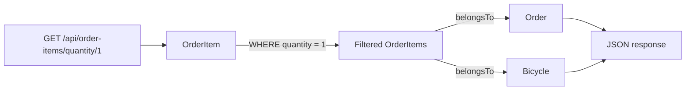
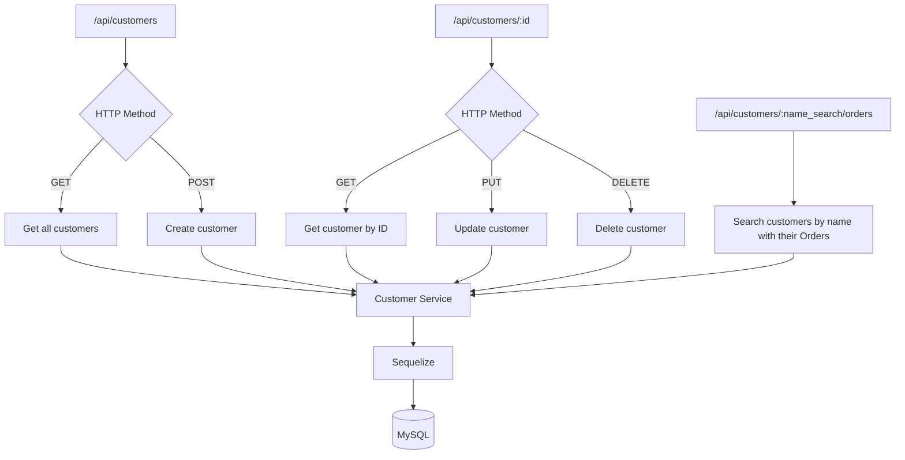
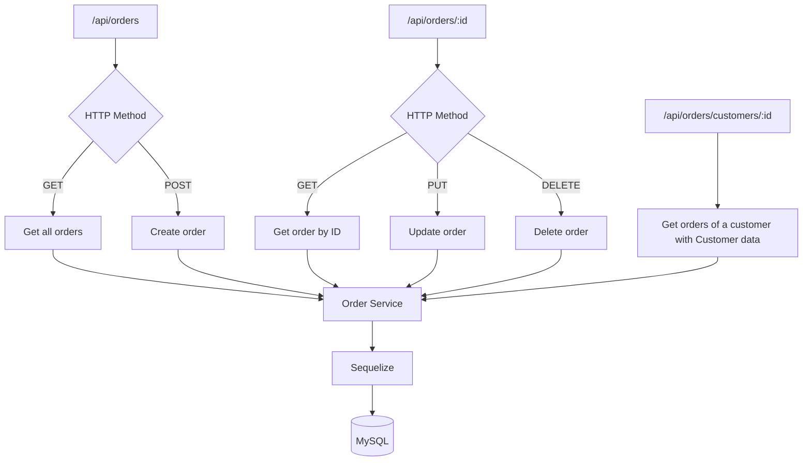
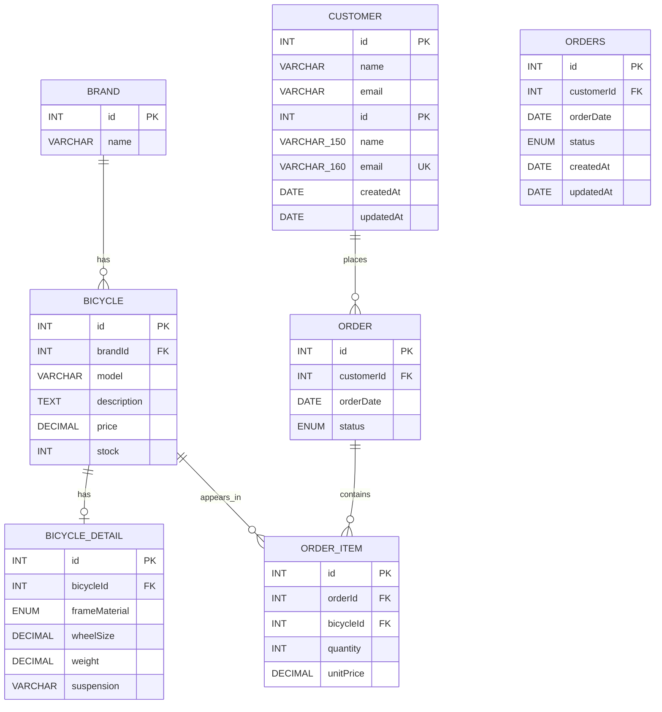
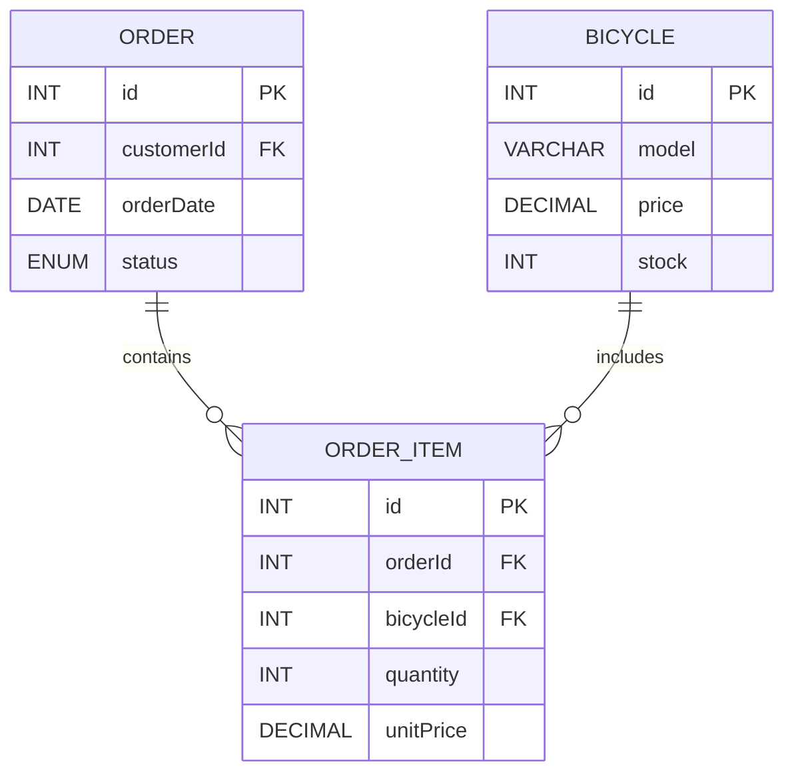

# Bicycle Shop --- Delivery 5

A full-stack learning project for managing a bicycle shop through a REST
API and a React user interface.

The project uses a backend built with TypeScript, Node.js, Express,
Sequelize, and MySQL, together with a frontend built with TypeScript,
React, Vite, and Tailwind CSS.

Delivery 5 extends the previous project with customers, orders, and
order items. The backend now models the complete relationship between
customers, orders, order lines, and bicycles, in addition to the
existing bicycle, brand, and technical-detail functionality.

## Getting Started

These instructions will help you set up and run the project locally for
development and testing.

### Prerequisites

Make sure the following software is installed:

-   Git
-   Node.js with npm
-   MySQL
-   An API client for testing HTTP requests

A Node.js version compatible with the installed Vite version is
required.

### Installing

Clone the repository and enter the project directory:

``` bash
git clone <REPOSITORY_URL>
cd bicycle-shop-dsw-entrega-5
```

The project contains two applications:

``` text
bicycle-shop-dsw-entrega-5/
├── backend/
├── frontend/
└── README.md
```

### Database setup

Start MySQL and create the database:

``` sql
CREATE DATABASE IF NOT EXISTS db_bicycle_shop
CHARACTER SET utf8mb4;
```

The configured MySQL user must have permission to access the database
and create its tables.

### Backend configuration

Create a `.env` file inside `backend/`. Use `backend/.env.example` as a
reference:

``` dotenv
PORT=3000

DB_HOST=localhost
DB_PORT=3306
DB_NAME=db_bicycle_shop
DB_USER=your-database-username
DB_PASSWORD=your-database-password
```

Replace `DB_USER` and `DB_PASSWORD` with your MySQL credentials.

> **Note:** if a variable is missing, `backend/src/config/env.ts` falls back to default values (`PORT=3000`, `DB_HOST=localhost`, `DB_PORT=3306`, `DB_USER=root`, an empty password, and `DB_NAME=dsw_products`). The default database name is **not** the same as the one in `.env.example`, so always define `DB_NAME` explicitly.

Install the backend dependencies:

``` bash
cd backend
npm ci
```

Start the backend in development mode:

``` bash
npm run dev
```

The server runs by default at:

``` text
http://localhost:3000
```

The API base URL is:

``` text
http://localhost:3000/api
```

The root endpoint can be used to verify that the API is running:

``` http
GET /
```

Response:

``` json
{
  "message": "API working"
}
```

> **Important:** the current backend uses
> `sequelize.sync({ force: true })`. Every time the backend starts,
> Sequelize recreates the database tables, so existing data can be
> deleted. This setting should be reviewed before using persistent or
> production data.

### Frontend configuration

Create a `.env` file inside `frontend/`. Use `frontend/.env.example` as
a reference:

``` dotenv
VITE_API_URL=http://localhost:3000/api
```

Install the frontend dependencies:

``` bash
cd frontend
npm ci
```

Start the frontend development server:

``` bash
npm run dev
```

Open the local URL displayed by Vite in the terminal.

> **Note:** the frontend currently only contains the bicycle listing and management screen. Brands, bicycle details, customers, and orders are available through the API only. See [Known Issues](#known-issues) for the current frontend/backend mismatch.

## API

The backend exposes REST endpoints for bicycles, brands, bicycle
details, customers, orders, and order items.

### Bicycle endpoints

  -------------------------------------------------------------------------------------------------------
  Method                  Endpoint                                                Description
  ----------------------- ------------------------------------------------------- -----------------------
  `GET`                   `/api/bicycles`                                         Get all bicycles

  `GET`                   `/api/bicycles/:id`                                     Get a bicycle by ID

  `GET`                   `/api/bicycles/eagerly/:id`                             Get a bicycle by ID
                                                                                  including its brand

  `GET`                   `/api/bicycles/eagerly/frame-material/:frameMaterial`   Get bicycles filtered
                                                                                  by frame material

  `POST`                  `/api/bicycles`                                         Create a bicycle

  `PUT`                   `/api/bicycles/:id`                                     Update a bicycle

  `DELETE`                `/api/bicycles/:id`                                     Delete a bicycle
  -------------------------------------------------------------------------------------------------------

A bicycle contains:

-   `id`
-   `brandId`
-   `model`
-   `description`
-   `price`
-   `stock`
-   `createdAt`
-   `updatedAt`

### Brand endpoints

  Method     Endpoint            Description
  ---------- ------------------- -------------------
  `GET`      `/api/brands`       Get all brands
  `GET`      `/api/brands/:id`   Get a brand by ID
  `POST`     `/api/brands`       Create a brand
  `PUT`      `/api/brands/:id`   Update a brand
  `DELETE`   `/api/brands/:id`   Delete a brand

A brand contains:

-   `id`
-   `name`
-   `createdAt`
-   `updatedAt`

A brand that still has bicycles cannot be deleted (`ON DELETE RESTRICT`); the request fails until its bicycles are removed or moved to another brand.

### Bicycle detail endpoints

  ------------------------------------------------------------------------------------
  Method                  Endpoint                             Description
  ----------------------- ------------------------------------ -----------------------
  `GET`                   `/api/bicycle-details`               Get all bicycle details

  `GET`                   `/api/bicycle-details/:id`           Get a bicycle detail by
                                                               ID

  `GET`                   `/api/bicycle-details/eagerly/:id`   Eager-loading endpoint
                                                               present in the backend

  `POST`                  `/api/bicycle-details`               Create a bicycle detail

  `PUT`                   `/api/bicycle-details/:id`           Update a bicycle detail

  `DELETE`                `/api/bicycle-details/:id`           Delete a bicycle detail
  ------------------------------------------------------------------------------------

A bicycle detail contains:

-   `id`
-   `bicycleId`
-   `frameMaterial`
-   `wheelSize`
-   `weight`
-   `suspension`
-   `createdAt`
-   `updatedAt`

Accepted `frameMaterial` values are `Aluminum`, `Carbon`, `Steel`, and
`Titanium`.

### Customer endpoints

  --------------------------------------------------------------------------------------
  Method                  Endpoint                               Description
  ----------------------- -------------------------------------- -----------------------
  `GET`                   `/api/customers`                       Get all customers

  `GET`                   `/api/customers/:id`                   Get a customer by ID

  `GET`                   `/api/customers/:name_search/orders`   Search customers by
                                                                 name and include their
                                                                 orders

  `POST`                  `/api/customers`                       Create a customer

  `PUT`                   `/api/customers/:id`                   Update a customer

  `DELETE`                `/api/customers/:id`                   Delete a customer
  --------------------------------------------------------------------------------------

A customer contains:

-   `id`
-   `name`
-   `email`
-   `createdAt`
-   `updatedAt`

The `email` field is unique.

### Order endpoints

  -----------------------------------------------------------------------------
  Method                  Endpoint                      Description
  ----------------------- ----------------------------- -----------------------
  `GET`                   `/api/orders`                 Get all orders

  `GET`                   `/api/orders/:id`             Get an order by ID

  `GET`                   `/api/orders/customers/:id`   Get orders belonging to
                                                        a customer and include
                                                        customer data

  `POST`                  `/api/orders`                 Create an order

  `PUT`                   `/api/orders/:id`             Update an order

  `DELETE`                `/api/orders/:id`             Delete an order
  -----------------------------------------------------------------------------

An order contains:

-   `id`
-   `customerId`
-   `orderDate`
-   `status`
-   `createdAt`
-   `updatedAt`

Accepted order statuses are:

-   `pending`
-   `paid`
-   `shipped`
-   `cancelled`

### Order item endpoints

  ---------------------------------------------------------------------------------------
  Method                  Endpoint                                Description
  ----------------------- --------------------------------------- -----------------------
  `GET`                   `/api/order-items`                      Get all order items
                                                                  including their order
                                                                  and bicycle

  `GET`                   `/api/order-items/:id`                  Get an order item by ID

  `GET`                   `/api/order-items/quantity/:quantity`   Get order items by
                                                                  quantity including
                                                                  their order and bicycle

  `POST`                  `/api/order-items`                      Create an order item

  `PUT`                   `/api/order-items/:id`                  Update an order item

  `DELETE`                `/api/order-items/:id`                  Delete an order item
  ---------------------------------------------------------------------------------------

An order item contains:

-   `id`
-   `orderId`
-   `bicycleId`
-   `quantity`
-   `unitPrice`
-   `createdAt`
-   `updatedAt`

`quantity` must be at least `1` and `unitPrice` cannot be negative.

## Custom Query

### Order items filtered by quantity

The custom query created for Delivery 5 is:

``` http
GET /api/order-items/quantity/:quantity
```

Its purpose is to retrieve the order items that have a specific quantity
while also including the related `Order` and `Bicycle`.

For the current sample data, where the order-item quantity is `1`, the
request is:

``` http
GET /api/order-items/quantity/1
```

The query is implemented from `OrderItem` and uses eager loading to
involve all three required models:

-   `OrderItem` is the main model and is filtered by `quantity`.
-   `Order` is included through the `order` association.
-   `Bicycle` is included through the `bicycle` association.

The service query is conceptually:

``` typescript
OrderItem.findAll({
    where: {
        quantity: quantity
    },
    include: [
        {
            model: Order,
            as: "order"
        },
        {
            model: Bicycle,
            as: "bicycle"
        }
    ]
});
```

This makes the custom query different from a simple `findAll()`: it
filters the order lines by a requested quantity and returns the
associated order and bicycle information in the same query.



## API Request Flow

``` mermaid
flowchart LR
    U[User] --> F[React Frontend]
    F -->|HTTP request| API[Express REST API]

    API --> BR[/api/brands]
    API --> BI[/api/bicycles]
    API --> BD[/api/bicycle-details]
    API --> CU[/api/customers]
    API --> OR[/api/orders]
    API --> OI[/api/order-items]

    BR --> C[Controllers]
    BI --> C
    BD --> C
    CU --> C
    OR --> C
    OI --> C

    C --> S[Services]
    S --> ORM[Sequelize ORM]
    ORM --> DB[(MySQL)]

    DB --> ORM
    ORM --> S
    S --> C
    C --> API
    API -->|JSON response| F
```

### Customer Queries



### Order Queries



## Database Model

The current Sequelize associations define:

-   One `Brand` can have many `Bicycle` records.
-   Each `Bicycle` belongs to one `Brand`.
-   One `Bicycle` can have one `BicycleDetail`.
-   Each `BicycleDetail` belongs to one `Bicycle`.
-   One `Customer` can have many `Order` records.
-   Each `Order` belongs to one `Customer`.
-   One `Order` can contain many `OrderItem` records.
-   Each `OrderItem` belongs to one `Order`.
-   One `Bicycle` can appear in many `OrderItem` records.
-   Each `OrderItem` belongs to one `Bicycle`.
-   `Order` and `Bicycle` also have a many-to-many relationship through
    `OrderItem`.



## Relationship Used by the Custom Query

The custom Delivery 5 query focuses on these three models:



## Other Eager-Loading Queries

### Bicycle with its brand

``` http
GET /api/bicycles/eagerly/:id
```

This query retrieves a bicycle together with its associated brand.

### Bicycles filtered by frame material

``` http
GET /api/bicycles/eagerly/frame-material/:frameMaterial
```

For example:

``` http
GET /api/bicycles/eagerly/frame-material/Carbon
```

This query joins `Bicycle` with `BicycleDetail` and filters the result
by frame material.

### Customers searched by name with their orders

``` http
GET /api/customers/:name_search/orders
```

This query searches customer names using a partial match and includes
their associated orders.

### Orders by customer

``` http
GET /api/orders/customers/:id
```

This query returns orders for a specific customer and includes the
customer's `id`, `name`, and `email`.

The repository also includes the request collection in `backend/docs/`:

- `bicycle-shop-in-the-classroom.postman_collection.json`: Postman collection that can be imported directly into Postman.
- `bicycle-shop-in-the-classroom/`: the same requests as an OpenCollection folder of YAML files, grouped by `bicycles`, `bicyclesDetails`, `brands`, `customers`, and `orders`.

## Known Issues

These points were found while reviewing the current code. They do not prevent the API from starting, but they should be reviewed before using the project beyond local development:

- **Data loss on startup:** `sequelize.sync({ force: true })` drops and recreates all tables every time the backend starts.
- **Frontend and backend are out of sync:** the frontend sends and displays a text field named `brand`, while the backend expects `brandId` and returns bicycles without the brand name. Creating or editing a bicycle from the UI is rejected by the API (`brandId` is required), and the list cannot show the brand until the frontend uses `brandId` or the API includes the brand in the response.
- **Broken eager-loading endpoint:** `GET /api/bicycle-details/eagerly/:id` includes the wrong model/alias (see the implementation note in [Bicycle detail endpoints](#bicycle-detail-endpoints)).
- **Typo in an error response:** `GET /api/bicycles/eagerly/:id` returns `{ "messsage": "Bicycle not found" }` (three `s`) instead of `message` when the bicycle does not exist.
- **Generic database errors:** a duplicate customer email, deleting a brand that still has bicycles, or creating a record with a non-existent foreign key is not handled specifically; the error middleware answers with a generic `500` response instead of a `400`/`409`.
- **Weak validation on bicycle details:** the controller requires `frameMaterial`, `wheelSize`, and `weight`, but those columns are nullable at database level.
- **Mixed languages in API messages:** most messages are in English, while the validation message for bicycles and the `404`/`500` middleware messages are in Spanish.
- **Orders without items:** an order cannot yet reference any bicycle.

## Running the Tests

The project currently does not include an automated test suite or a
`test` script in its package configuration.

The API can be tested manually using an API client and the request
collections kept with the project.

The frontend includes a lint command:

``` bash
cd frontend
npm run lint
```

## Deployment

Build the backend:

``` bash
cd backend
npm run build
```

Start the compiled backend:

``` bash
npm start
```

Build the frontend:

``` bash
cd frontend
npm run build
```

Preview the frontend production build locally:

``` bash
npm run preview
```

Before deploying, configure the production environment variables and
MySQL connection correctly.

The following backend configuration must also be reviewed before using
persistent production data:

``` typescript
sequelize.sync({ force: true })
```

Using `force: true` recreates the tables when the application starts.

## Built With

### Backend

-   TypeScript
-   Node.js
-   Express 5
-   Sequelize 6
-   MySQL / mysql2
-   CORS
-   dotenv
-   tsx

### Frontend

-   TypeScript
-   React 19
-   Vite 8
-   Tailwind CSS 4
-   Oxlint

### Development tools

-   Git
-   npm
-   API client collections for manual endpoint testing

## Project Structure

``` text
bicycle-shop-dsw-entrega-5/
│
├── backend/
│   ├── docs/
│   ├── src/
│   │   ├── config/
│   │   ├── middlewares/
│   │   ├── models/
│   │   │   └── associations.ts
│   │   ├── modules/
│   │   │   ├── bicycle-details/
│   │   │   ├── bicycles/
│   │   │   ├── brands/
│   │   │   ├── customers/
│   │   │   ├── order-items/
│   │   │   └── orders/
│   │   ├── routes/
│   │   ├── app.ts
│   │   └── server.ts
│   ├── .env.example
│   ├── package.json
│   └── tsconfig.json
│
├── frontend/
│   ├── src/
│   │   ├── components/
│   │   ├── features/
│   │   ├── services/
│   │   ├── styles/
│   │   ├── App.tsx
│   │   └── main.tsx
│   ├── .env.example
│   ├── package.json
│   └── vite.config.ts
│
└── README.md
```

Each backend module (`bicycle-details`, `bicycles`, `brands`, `customers`, and `orders`) follows the same layered structure:

```text
<module>/
├── <name>.model.ts        # Sequelize model
├── <name>.service.ts      # Database queries
├── <name>.controller.ts   # Validation and HTTP responses
└── <name>.routes.ts       # Express routes
```

## Contributing

There is currently no separate `CONTRIBUTING.md` file in the project.

A typical contribution workflow is:

1.  Create a new branch from the main development branch.
2.  Make the required changes.
3.  Verify that the backend and frontend run correctly.
4.  Run the available lint checks.
5.  Commit the changes with a clear description.
6.  Open a Pull Request for review.

## Versioning

Git is used for version control.

Repository history and releases, when available, can be used to track
project versions and changes.

## Authors

-   **Victor Manuel Garcia Batista** --- Author and developer.

## Contributors

-   **Tiburcio Cruz Ravelo** --- Contributor and teacher.

## License

The backend `package.json` declares the **ISC** license.

If the repository is distributed publicly, adding a dedicated `LICENSE`
file is recommended so that the licensing terms are clearly available at
repository level.

## Acknowledgments

-   README structure based on the README template by PurpleBooth.
-   Official documentation for the technologies used in the project.
-   Thanks to everyone who contributed to the development and
    improvement of the project.
