# Bicycle Shop

A full-stack learning project for managing a bicycle shop through a REST API and a React user interface.

The backend is built with TypeScript, Node.js, Express, Sequelize, and MySQL. The frontend is built with TypeScript, React, Vite, and Tailwind CSS. The project provides CRUD operations for **bicycles**, **brands**, **bicycle technical details**, **customers**, and **orders**, as well as queries that use Sequelize associations (eager loading), such as a bicycle with its brand, bicycles filtered by frame material, and customers searched by name together with their orders.

## Table of Contents

- [Getting Started](#getting-started)
- [API](#api)
- [API Request Flow](#api-request-flow)
- [Queries by Resource](#queries-by-resource)
- [Database Model](#database-model)
- [Eager Loading Queries](#eager-loading-queries)
- [Example Requests](#example-requests)
- [Postman](#postman)
- [Known Issues](#known-issues)
- [Running the Tests](#running-the-tests)
- [Deployment](#deployment)
- [Built With](#built-with)
- [Project Structure](#project-structure)
- [Contributing](#contributing)
- [Versioning](#versioning)
- [Authors](#authors)
- [Contributors](#contributors)
- [License](#license)
- [Acknowledgments](#acknowledgments)

## Getting Started

These instructions will help you set up and run the project locally for development and testing.

### Prerequisites

Make sure the following software is installed:

- Git
- Node.js with npm
- MySQL
- Postman (recommended for testing the API)

A Node.js version compatible with the installed Vite version is required.

### Installing

Clone the repository and enter the project directory:

```bash
git clone <REPOSITORY_URL>
cd bicycle-shop-dsw-entrega-4
```

The project contains two applications:

```text
bicycle-shop-dsw-entrega-4/
├── backend/
├── frontend/
└── README.md
```

### Database setup

Start MySQL and create the database:

```sql
CREATE DATABASE IF NOT EXISTS db_bicycle_shop
CHARACTER SET utf8mb4;
```

The configured MySQL user must have permission to access the database and create its tables. The tables (`brands`, `bicycles`, `bicycle_details`, `Customers`, and `orders`) are created automatically by Sequelize when the backend starts.

### Backend configuration

Create a `.env` file inside `backend/`. Use `backend/.env.example` as a reference:

```dotenv
PORT=3000

DB_HOST=localhost
DB_PORT=3306
DB_NAME=db_bicycle_shop
DB_USER=your-database-username
DB_PASSWORD=your-database-password
```

Replace `DB_USER` and `DB_PASSWORD` with your MySQL credentials.

> **Note:** if a variable is missing, `backend/src/config/env.ts` falls back to default values (`PORT=3000`, `DB_HOST=localhost`, `DB_PORT=3306`, `DB_USER=root`, an empty password, and `DB_NAME=dsw_products`). The default database name is **not** the same as the one in `.env.example`, so always define `DB_NAME` explicitly.

Install the backend dependencies:

```bash
cd backend
npm ci
```

Start the backend in development mode:

```bash
npm run dev
```

The server runs by default at:

```text
http://localhost:3000
```

The API base URL is:

```text
http://localhost:3000/api
```

The root endpoint can be used to verify that the API is running:

```http
GET /
```

Response:

```json
{
  "message": "API working"
}
```

> **Important:** the current backend uses `sequelize.sync({ force: true })`. Every time the backend starts, Sequelize drops and recreates the database tables, so existing data is deleted. This setting should be reviewed before using persistent or production data.

### Frontend configuration

Create a `.env` file inside `frontend/`. Use `frontend/.env.example` as a reference:

```dotenv
VITE_API_URL=http://localhost:3000/api
```

Install the frontend dependencies:

```bash
cd frontend
npm ci
```

Start the frontend development server:

```bash
npm run dev
```

Open the local URL displayed by Vite in the terminal.

> **Note:** the frontend currently only contains the bicycle listing and management screen. Brands, bicycle details, customers, and orders are available through the API only. See [Known Issues](#known-issues) for the current frontend/backend mismatch.

## API

The backend exposes REST endpoints for bicycles, brands, bicycle details, customers, and orders. All of them are served under the `/api` prefix.

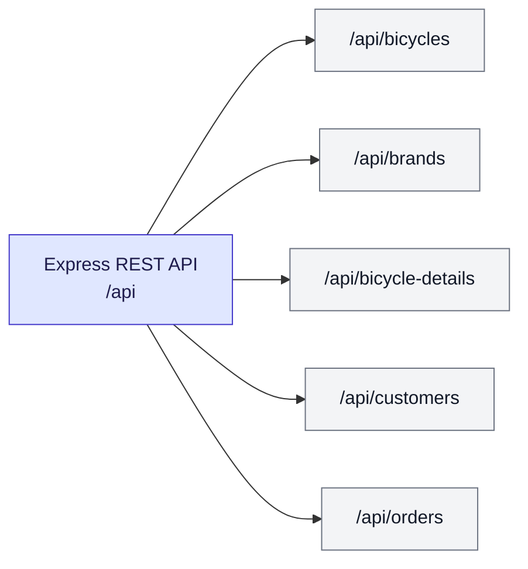

In the endpoint diagrams below, each box is one endpoint (one row of the former tables). Colors indicate the HTTP method:

- Green: `GET`
- Blue: `POST`
- Amber: `PUT`
- Red: `DELETE`

### Bicycle endpoints

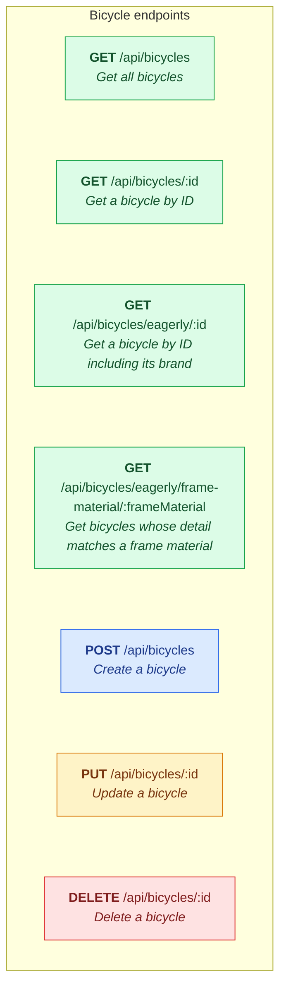

A bicycle contains the following fields:

- `id`
- `brandId`
- `model`
- `description`
- `price`
- `stock`
- `createdAt`
- `updatedAt`

When creating a bicycle, `brandId`, `model`, and `price` are required by the controller. `stock` defaults to `0` at model level when it is not supplied.

### Brand endpoints

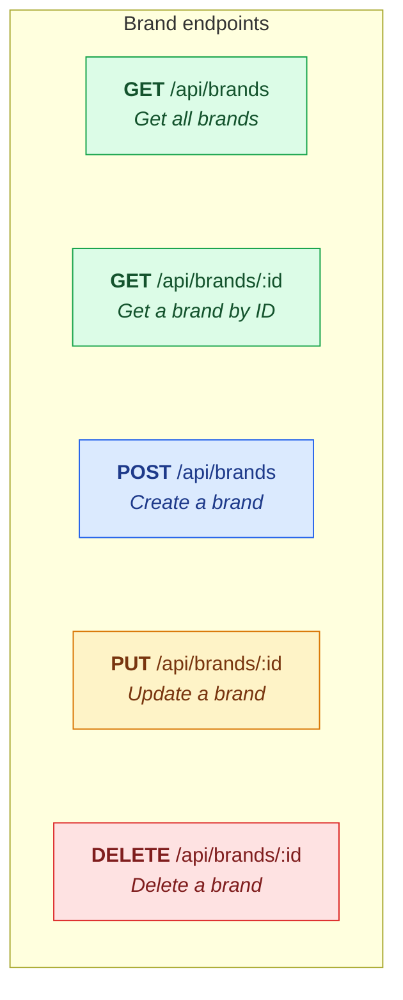

A brand contains:

- `id`
- `name`
- `createdAt`
- `updatedAt`

The `name` field is required when creating a brand.

A brand that still has bicycles cannot be deleted (`ON DELETE RESTRICT`); the request fails until its bicycles are removed or moved to another brand.

### Bicycle detail endpoints

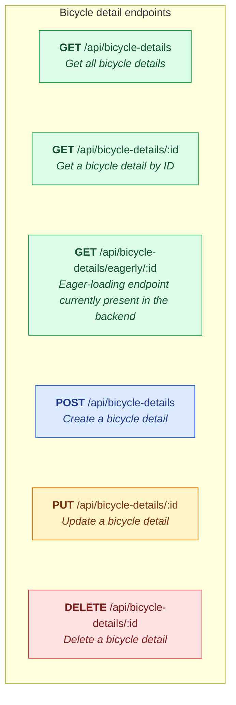

A bicycle detail contains:

- `id`
- `bicycleId`
- `frameMaterial`
- `wheelSize`
- `weight`
- `suspension`
- `createdAt`
- `updatedAt`

The accepted `frameMaterial` values are:

- `Aluminum`
- `Carbon`
- `Steel`
- `Titanium`

When creating a bicycle detail, `bicycleId`, `frameMaterial`, `wheelSize`, and `weight` are required by the controller. `suspension` is optional.

The `bicycleId` field is unique, enforcing one technical-detail record per bicycle.

> **Implementation note:** `/api/bicycle-details/eagerly/:id` exists in the current routes, but its service currently includes `BicycleDetail` itself using the alias `bicycleDetail`. The defined association is instead `BicycleDetail.belongsTo(Bicycle, { as: "bicycle" })`. The endpoint should therefore be reviewed before relying on its eager-loading response.

### Customer endpoints

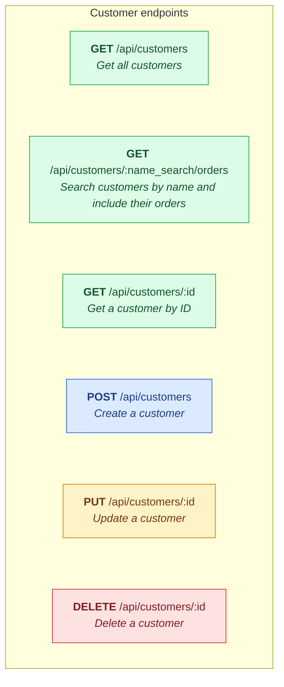

A customer contains:

- `id`
- `name`
- `email`
- `createdAt`
- `updatedAt`

When creating a customer, `name` and `email` are required by the controller. The `email` field is unique.

`GET /api/customers/:name_search/orders` performs a partial, `LIKE`-based search on the customer name (for example, `jua` matches `Juan`). It uses an inner join, so **only customers that have at least one order are returned**, each with an `orders` array.

Deleting a customer also deletes all of their orders (`ON DELETE CASCADE`).

### Order endpoints

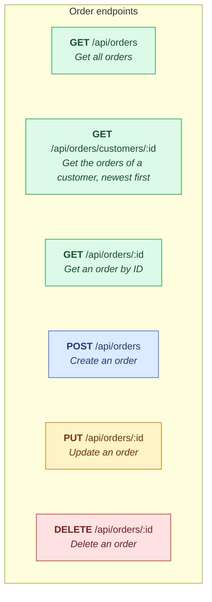

An order contains:

- `id`
- `customerId`
- `orderDate`
- `status`
- `createdAt`
- `updatedAt`

The accepted `status` values are:

- `pending`
- `paid`
- `shipped`
- `cancelled`

When creating an order, `customerId`, `orderDate`, and `status` are required by the controller. Although the model defines defaults (`orderDate` = current date and `status` = `pending`), the controller currently rejects requests that omit them.

`GET /api/orders/customers/:id` returns the orders of one customer sorted by `orderDate` in descending order, and includes the customer's `id`, `name`, and `email`.

> **Note:** orders are not yet linked to bicycles. An order only stores its customer, date, and status; there are no order lines.

## API Request Flow

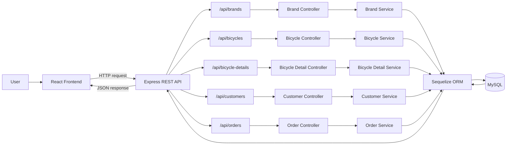

Requests that do not match any route receive a `404` response (`Ruta no encontrada`), and unhandled errors are caught by the error middleware, which returns a `500` response (`Error interno del servidor`).

## Queries by Resource

### Bicycle Queries

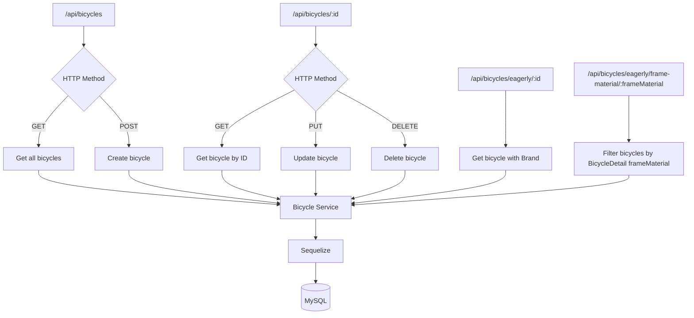

### Brand Queries

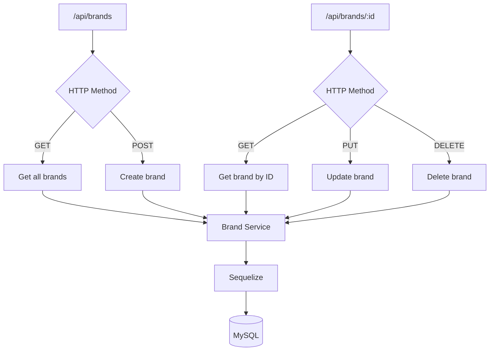

### Bicycle Detail Queries

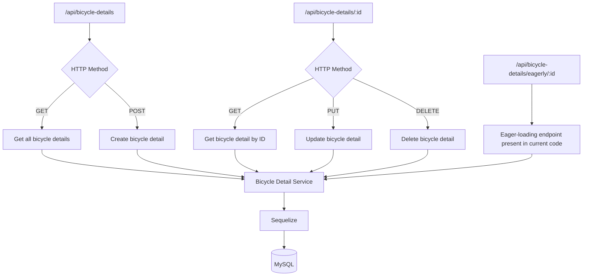

### Customer Queries

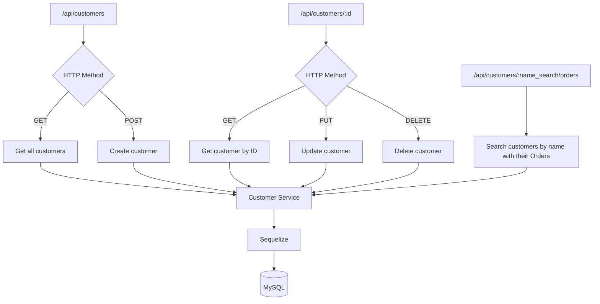

### Order Queries

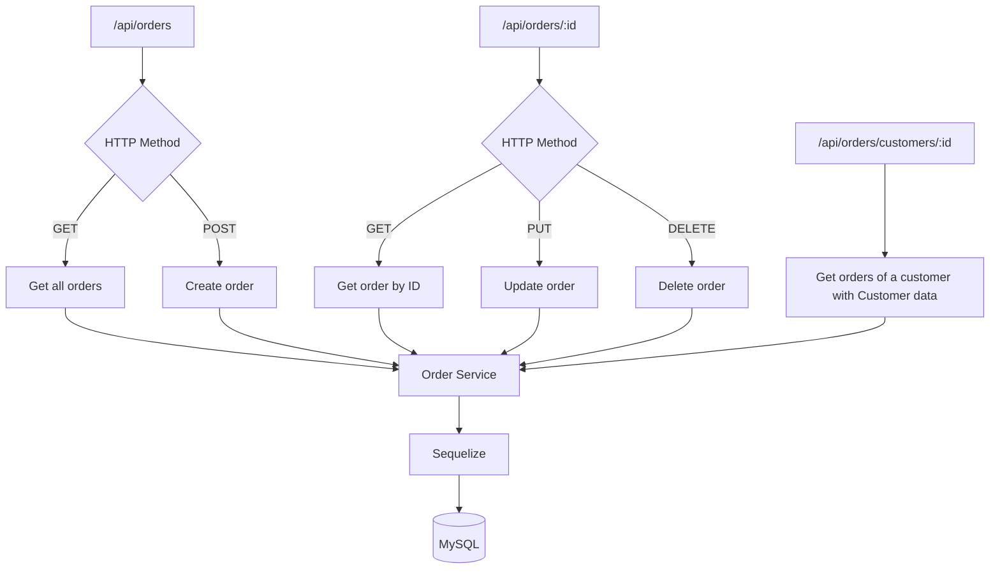

## Database Model

The current Sequelize associations define:

- One `Brand` can have many `Bicycle` records.
- Each `Bicycle` belongs to one `Brand`.
- One `Bicycle` can have one `BicycleDetail`.
- Each `BicycleDetail` belongs to one `Bicycle`.
- One `Customer` can have many `Order` records.
- Each `Order` belongs to one `Customer`.

Referential actions of the generated foreign keys:

- `bicycles.brandId` → `brands.id`: `ON UPDATE CASCADE`, `ON DELETE RESTRICT`.
- `bicycle_details.bicycleId` → `bicycles.id`: `ON UPDATE CASCADE`, `ON DELETE CASCADE`.
- `orders.customerId` → `Customers.id`: `ON UPDATE CASCADE`, `ON DELETE CASCADE`.

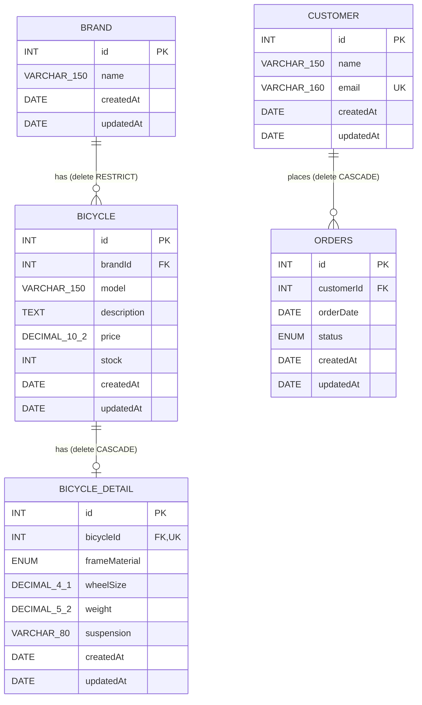

> **Table names:** the MySQL tables are `brands`, `bicycles`, `bicycle_details`, `orders`, and `Customers`. The customers table is the only one with a capitalized name. On case-sensitive systems (for example, MySQL on Linux), always write it as `Customers` in manual SQL queries.

## Eager Loading Queries

### Bicycle with its brand

The project can retrieve a bicycle together with its associated brand:

```http
GET /api/bicycles/eagerly/:id
```

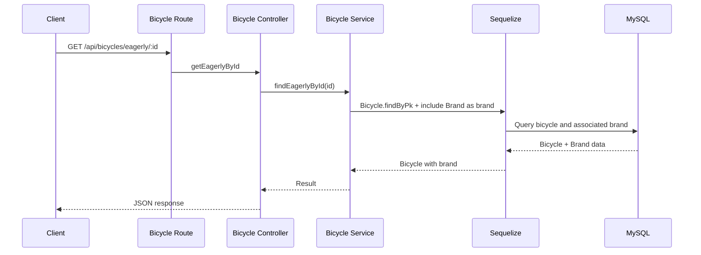

### Bicycles filtered by frame material

The project also performs an eager-loading query against `BicycleDetail` and filters the joined detail by `frameMaterial`:

```http
GET /api/bicycles/eagerly/frame-material/:frameMaterial
```

For example:

```http
GET /api/bicycles/eagerly/frame-material/Carbon
```

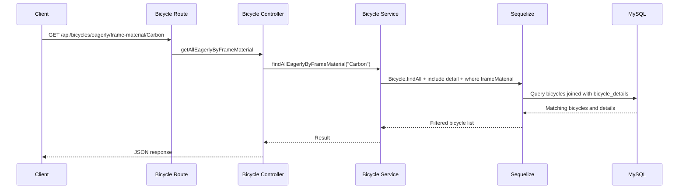

### Customers searched by name with their orders

The project can search customers by a partial name and return them together with their orders:

```http
GET /api/customers/:name_search/orders
```

For example:

```http
GET /api/customers/jua/orders
```

Because the include uses `required: true`, customers without orders are not part of the result.

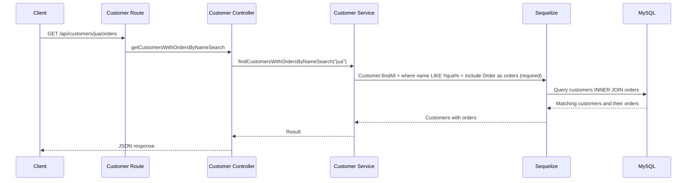

### Orders of a customer

The project can retrieve all the orders of a customer, including basic customer data:

```http
GET /api/orders/customers/:id
```

For example:

```http
GET /api/orders/customers/1
```

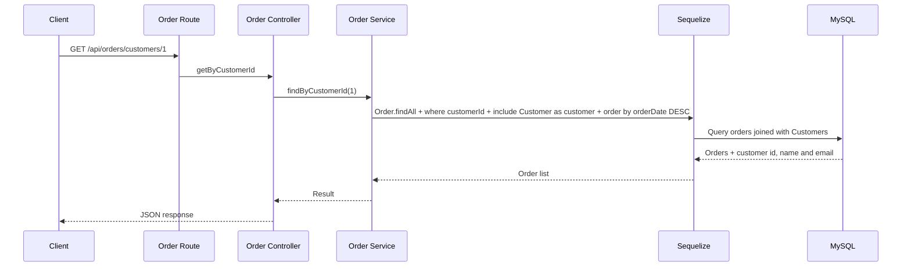

## Example Requests

Create a brand (it must exist before creating bicycles):

```http
POST /api/brands
Content-Type: application/json

{
  "name": "bh"
}
```

Create a bicycle:

```http
POST /api/bicycles
Content-Type: application/json

{
  "brandId": 1,
  "model": "Sky",
  "description": "Great for any occasion",
  "price": 189.99,
  "stock": 10
}
```

Create a bicycle detail:

```http
POST /api/bicycle-details
Content-Type: application/json

{
  "bicycleId": 1,
  "frameMaterial": "Steel",
  "wheelSize": 29,
  "weight": 4,
  "suspension": "Front"
}
```

Create a customer:

```http
POST /api/customers
Content-Type: application/json

{
  "name": "Juan",
  "email": "juan@gmail.com"
}
```

Create an order for that customer:

```http
POST /api/orders
Content-Type: application/json

{
  "customerId": 1,
  "orderDate": "2026-10-01T18:50:00.000Z",
  "status": "pending"
}
```

## Postman

The API can be tested using the existing Postman documentation:

https://documenter.getpostman.com/view/58320211/2sBYB4L76J

The Postman documentation can be used alongside the endpoint reference in this README to test the API.

The repository also includes the request collection in `backend/docs/`:

- `bicycle-shop-in-the-classroom.postman_collection.json`: Postman collection that can be imported directly into Postman.
- `bicycle-shop-in-the-classroom/`: the same requests as an OpenCollection folder of YAML files, grouped by `bicycles`, `bicyclesDetails`, `brands`, `customers`, and `orders`.

## Known Issues

These points were found while reviewing the current code. They do not prevent the API from starting, but they should be reviewed before using the project beyond local development:

- **Data loss on startup:** `sequelize.sync({ force: true })` drops and recreates all tables every time the backend starts.
- **Frontend and backend are out of sync:** the frontend sends and displays a text field named `brand`, while the backend expects `brandId` and returns bicycles without the brand name. Creating or editing a bicycle from the UI is rejected by the API (`brandId` is required), and the list cannot show the brand until the frontend uses `brandId` or the API includes the brand in the response.
- **Broken eager-loading endpoint:** `GET /api/bicycle-details/eagerly/:id` includes the wrong model/alias (see the implementation note in [Bicycle detail endpoints](#bicycle-detail-endpoints)).
- **Typo in an error response:** `GET /api/bicycles/eagerly/:id` returns `{ "messsage": "Bicycle not found" }` (three `s`) instead of `message` when the bicycle does not exist.
- **Generic database errors:** a duplicate customer email, deleting a brand that still has bicycles, or creating a record with a non-existent foreign key is not handled specifically; the error middleware answers with a generic `500` response instead of a `400`/`409`.
- **Weak validation on bicycle details:** the controller requires `frameMaterial`, `wheelSize`, and `weight`, but those columns are nullable at database level.
- **Mixed languages in API messages:** most messages are in English, while the validation message for bicycles and the `404`/`500` middleware messages are in Spanish.
- **Orders without items:** an order cannot yet reference any bicycle.

## Running the Tests

The project currently does not include an automated test suite or a `test` script in its package configuration.

API functionality can be tested manually using Postman and the frontend interface.

The frontend includes a lint command:

```bash
cd frontend
npm run lint
```

## Deployment

Build the backend:

```bash
cd backend
npm run build
```

Start the compiled backend:

```bash
npm start
```

Build the frontend:

```bash
cd frontend
npm run build
```

Preview the frontend production build locally:

```bash
npm run preview
```

Before deploying, configure the production environment variables and MySQL connection correctly.

The following backend configuration must also be reviewed before using persistent production data:

```typescript
sequelize.sync({ force: true })
```

Using `force: true` recreates the tables when the application starts.

## Built With

### Backend

- TypeScript
- Node.js
- Express 5
- Sequelize 6
- MySQL / mysql2
- CORS
- dotenv
- tsx

### Frontend

- TypeScript
- React 19
- Vite 8
- Tailwind CSS 4
- Oxlint

### Development and API tools

- Git
- npm
- Postman
- Mermaid (diagrams in this README)

## Project Structure

```text
bicycle-shop-dsw-entrega-4/
│
├── backend/
│   ├── docs/
│   │   ├── bicycle-shop-in-the-classroom/
│   │   └── bicycle-shop-in-the-classroom.postman_collection.json
│   ├── src/
│   │   ├── config/
│   │   ├── middlewares/
│   │   ├── models/
│   │   │   └── associations.ts
│   │   ├── modules/
│   │   │   ├── bicycle-details/
│   │   │   ├── bicycles/
│   │   │   ├── brands/
│   │   │   ├── customers/
│   │   │   └── orders/
│   │   ├── routes/
│   │   ├── app.ts
│   │   └── server.ts
│   ├── .env.example
│   ├── package.json
│   └── tsconfig.json
│
├── frontend/
│   ├── src/
│   │   ├── components/
│   │   │   └── ui/
│   │   ├── features/
│   │   │   └── bicycles/
│   │   │       ├── components/
│   │   │       ├── hooks/
│   │   │       ├── pages/
│   │   │       ├── services/
│   │   │       └── types/
│   │   ├── services/
│   │   ├── styles/
│   │   ├── App.tsx
│   │   └── main.tsx
│   ├── .env.example
│   ├── package.json
│   └── vite.config.ts
│
└── README.md
```

Each backend module (`bicycle-details`, `bicycles`, `brands`, `customers`, and `orders`) follows the same layered structure:

```text
<module>/
├── <name>.model.ts        # Sequelize model
├── <name>.service.ts      # Database queries
├── <name>.controller.ts   # Validation and HTTP responses
└── <name>.routes.ts       # Express routes
```

## Contributing

There is currently no separate `CONTRIBUTING.md` file in the project.

A typical contribution workflow is:

1. Create a new branch from the main development branch.
2. Make the required changes.
3. Verify that the backend and frontend run correctly.
4. Run the available lint checks.
5. Commit the changes with a clear description.
6. Open a Pull Request for review.

## Versioning

Git is used for version control.

Repository history and releases, when available, can be used to track project versions and changes.

## Authors

- **Victor Manuel Garcia Batista** — Author and developer.

## Contributors

- **Tiburcio Cruz Ravelo** — Contributor and Teacher.

## License

The backend `package.json` currently declares the **ISC** license.

If the repository is distributed publicly, adding a dedicated `LICENSE` file is recommended so the licensing terms are clearly available at repository level.

## Acknowledgments

- README structure based on the README template by PurpleBooth.
- Official documentation for the technologies used in the project.
- Thanks to everyone who contributed to the development and improvement of the project.
